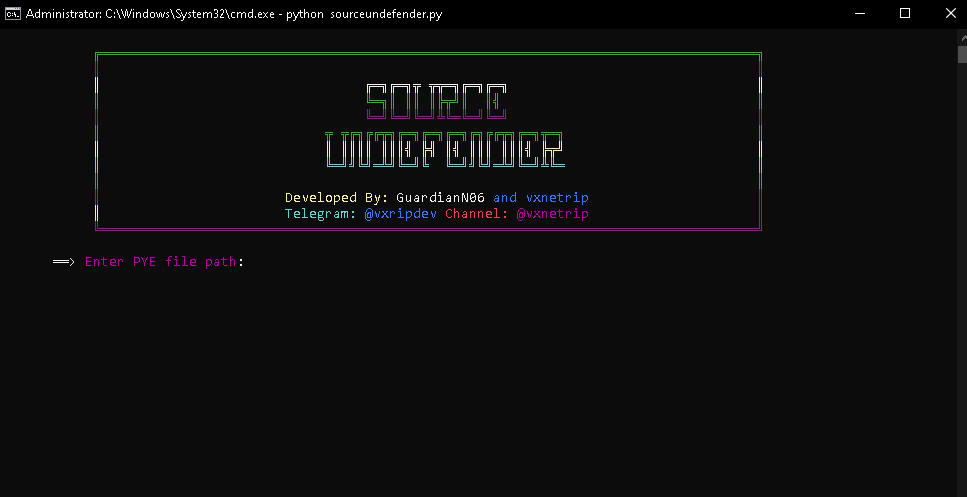

# SourceUndefender
Python script to decrypt sourcedefender files.

If you wish to use the online version go to [https://sourcedefender.onrender.com](https://sourcedefender.onrender.com)

Works on latest version 15.0.14 and some older versions.

Star if you like it :p

For other decryption services join us on our [Discord](https://discord.gg/N9CEjF6ArT)!

# Features
### Automatic key derivation and decryption
### Python bytecode header rebuilder
### Custom password and salt handling

# Usage
```
python sourceundefender.py
```

# Preview
<div align="center">
  
</div>


# How Key Derivation Works
```
key = hashlib.blake2b(password, digest_size=64).digest()
salt = hashlib.blake2b(presalt, digest_size=16).digest()
aes_key = hashlib.blake2b(key=key, salt=salt, digest_size=32).hexdigest()
```
That’s literally what they use.
Rename the file, and the key breaks, 10/10 security 🥴


For educational reasons only, don't steal code that isn't yours :)
